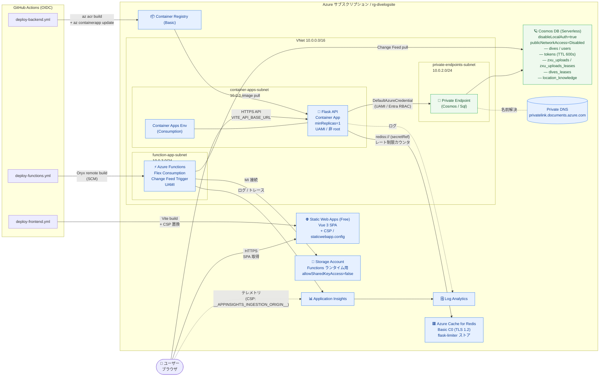
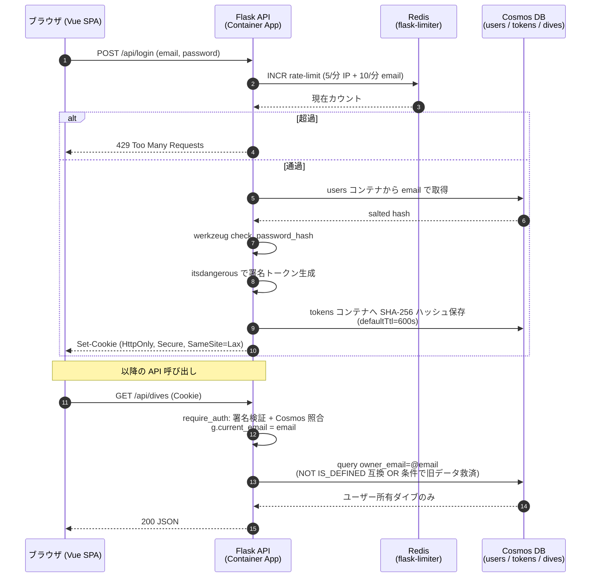
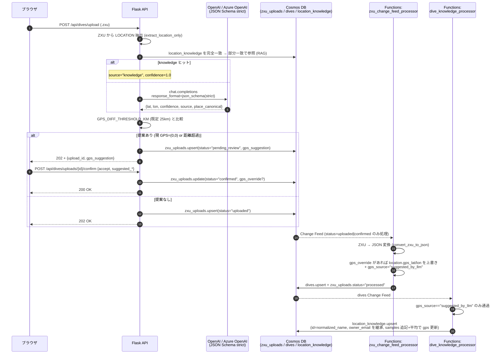

# アーキテクチャ

## システム構成

### 全体図（コンポーネント & データフロー）



Container Apps (`ca-divelog`) は Flask API 専用です。API ホストの `GET /` と `GET /health` は疎通確認用で、ユーザー画面は Static Web Apps の URL を開きます。

### 認証 / 認可 フロー



### ZXU アップロード（同期 GPS 提案 + 非同期変換）フロー



---

## Azure リソース構成

| リソース | SKU | 用途 |
|---|---|---|
| Azure Container Registry | Basic | バックエンドコンテナイメージ管理 |
| Azure Cache for Redis | Basic C0 (TLS 1.2 / nonSSL 無効 / `disableAccessKeyAuth=true` / `aad-enabled=true`) | flask-limiter の共有ストア（UAMI による Entra ID 認証、`Data Contributor` アクセスポリシー） |
| Azure Container Apps | Consumption (`minReplicas: 1`, VNet 統合) | Flask API ホスティング |
| Azure Functions | Flex Consumption (FC1, Python 3.11) | Cosmos DB Change Feed: (1) `zxu_change_feed_processor` で ZXU → JSON 変換、(2) `dive_knowledge_processor` で LLM 提案承認済みの GPS を `location_knowledge` へ蓄積 |
| Azure Storage | Standard_LRS (`allowSharedKeyAccess: false`, `publicNetworkAccess: Enabled`) | Functions ランタイム／Flex の `app-package` 用（MI/RBAC 接続）。管理グループ Policy の `SecurityControl=Ignore` タグを付け、デプロイ経路だけ公開ネットワークを許可。Blob 匿名アクセスは無効 |
| Application Insights | — | Functions のテレメトリ／ログ |
| Azure Static Web Apps | Free | Vue.js SPA ホスティング |
| Azure Cosmos DB | Serverless (`disableLocalAuth: true`) | ダイブログデータ永続化（Entra ID RBAC 認証）、ユーザー認証・トークン管理 |
| Azure Virtual Network | — | Container Apps + Private Endpoint のネットワーク分離 |
| Azure Private Endpoint | — | Cosmos DB へのプライベート接続 (groupId: Sql) |
| Azure Private DNS Zone | — | `privatelink.documents.azure.com` の名前解決 |
| Log Analytics Workspace | PerGB2018 (30 日保持) | Container Apps / Functions / App Insights のログ収集 |
| Azure OpenAI / Foundry (Cognitive Services `AIServices`) | Standard (`disableLocalAuth: true`) | GPS 提案 LLM のホスティング。`backend/services/location_resolver.py` から **Container Apps の UAMI** で Entra ID 認証 (`Cognitive Services OpenAI User` ロール)。Structured Outputs (`response_format=json_schema, strict=true`) 対応モデルをデプロイ |

> **Note**:
> - Key Vault は現在使用していません（マネージド ID + Container App secrets のみで構成）。
> - Azure OpenAI / Foundry は本ソリューションでは **`rg-divelogsite` 外の既存リソース**（例: `basicAI/maaya-lab`, swedencentral）を参照する運用です。Bicep からは作成せず、`AZURE_OPENAI_ENDPOINT` / `AZURE_OPENAI_DEPLOYMENT` などの環境変数のみを `ca-divelog` に注入し、UAMI `ca-divelog-id` に対する `Cognitive Services OpenAI User` ロール (`5e0bd9bd-7b93-4f28-af87-19fc36ad61bd`) は Azure OpenAI アカウント側のスコープで個別に付与します。

**リソースグループ**: `rg-divelogsite`（Azure OpenAI / Foundry は別 RG / 別リージョン可）

---

## ディレクトリ構成

```
divelog/
├── backend/                    # Flask REST API
│   ├── app.py                  # エントリポイント・ルーティング
│   ├── data.py                 # データアクセス層 (Cosmos DB / JSON フォールバック)
│   ├── services/               # サービス層
│   │   ├── location_resolver.py # LLM (OpenAI/Azure OpenAI) で GPS 推定 + RAG
│   │   ├── gps_diff.py          # haversine + 提案判定 (GPS_DIFF_THRESHOLD_KM)
│   │   └── location_knowledge.py# Cosmos location_knowledge コンテナアクセス
│   ├── prompts/                # LLM プロンプトバンドル（コードと分離）
│   │   └── gps_suggestion/
│   │       ├── system.md / user_template.md
│   │       ├── response_schema.json / config.yaml
│   │       └── README.md
│   ├── requirements.txt        # Python 依存パッケージ
│   ├── Dockerfile              # コンテナイメージビルド定義
│   ├── .env.example            # 環境変数サンプル
│   └── .dockerignore
│
├── frontend/                   # Vue 3 SPA
│   ├── src/
│   │   ├── main.js             # Vue Router 設定・ナビゲーションガード
│   │   ├── App.vue             # レイアウト・ハンバーガーメニュー・ログアウトボタン
│   │   ├── api/dives.js        # API クライアント（認証ヘッダー付与）
│   │   ├── composables/
│   │   │   └── useAuth.js      # 認証状態管理・自動ログアウト
│   │   └── views/
│   │   │   ├── HomeView.vue    # ダイブ一覧・ヒートマップ・検索（onBeforeUnmount で Leaflet map / heatLayer / markerLayer を明示的に破棄）
│   │       ├── DetailView.vue  # ダイブ詳細・水深グラフ・地図
│   │       ├── UploadView.vue  # ZXU ファイルアップロード・ダイブログ登録
│   │       └── LoginView.vue   # ログインフォーム
│   ├── index.html              # CDN (Bootstrap, Leaflet, Chart.js)
│   ├── vite.config.js          # Vite 設定・開発プロキシ
│   ├── staticwebapp.config.json # SPA ルーティングフォールバック設定
│   └── .env.example
│
├── infra/                      # IaC (Bicep)
│   ├── main.bicep              # オーケストレーション
│   ├── main.bicepparam         # デプロイパラメータ
│   └── modules/
│       ├── containerRegistry.bicep    # ACR (Basic)
│       ├── containerAppsEnv.bicep     # Log Analytics + CA 環境 (VNet 統合対応)
│       ├── containerApp.bicep         # Container Apps (Flask API)
│       ├── staticWebApp.bicep         # Static Web Apps (Vue.js / Free)
│       ├── staticWebAppConfig.bicep   # SWA appsettings (循環依存解消用)
│       ├── cosmosDb.bicep             # Cosmos DB Serverless (publicNetworkAccess: Disabled)
│       ├── cosmosRoleAssignment.bicep # Cosmos データプレーン RBAC 割り当て
│       ├── functionApp.bicep          # Function App (Flex Consumption) + Storage + AppInsights
│       └── network.bicep              # VNet + Private Endpoint + Private DNS Zone
│
├── workflow/                   # データ管理ユーティリティ
│   ├── convert_zxu_to_json.py # ZXU → JSON 変換（CLI + Functions から呼び出し）
│   ├── import_cosmos.py        # Cosmos DB インポートスクリプト
│   ├── json/                   # ローカル JSON ダイブログデータ
│   └── zxu/                    # ダイコン出力ファイル (入力)
│
├── functions/                  # Azure Functions (Change Feed)
│   ├── function_app.py         # Python v2 エントリポイント
│   │                           # — zxu_change_feed_processor: status=uploaded|confirmed → dives
│   │                           # — dive_knowledge_processor: dives → location_knowledge 蓄積
│   ├── host.json               # extensionBundle [4.*, 5.0.0)
│   └── requirements.txt
│
├── scripts/                    # 運用スクリプト
│   └── seed_user.py            # 初回ユーザー作成（手動実行）
│
├── docs/                       # ドキュメント
├── azure.yaml                  # Azure Developer CLI (azd) 設定
└── README.md
```

---

## フロントエンド依存ライブラリ

すべて npm でバンドルし、CDN 外部読み込みは行わない（CSP を `'self'` 中心に厳格化するため）。

| ライブラリ | バージョン | 用途 |
|---|---|---|
| vue | ^3.5 | UI フレームワーク |
| vue-router | ^4.5 | SPA ルーティング |
| chart.js | ^4.4 | 水深・水温グラフ |
| bootstrap | ^5.3 | CSS フレームワーク |
| bootstrap-icons | ^1.11 | アイコン |
| leaflet | ^1.9 | 地図表示 |
| leaflet.heat | ^0.2 | ヒートマップレイヤー |

初期読み込みで `frontend/src/main.js` にすべて `import` され、Vite がバンドルする。Leaflet は `window.L` にも代入し、既存コンポーネント（`HomeView.vue` / `DetailView.vue`）の `window.L.*` 参照を維持する。

---

## セキュリティ設計

### 認証・認可

- **マネージド ID**: Container Apps / Function App はユーザー割り当てマネージド ID (`ca-divelog-id` / `func-divelog-id`) を使用。パスワードレスで ACR 認証・Cosmos DB アクセス・Storage アクセスを行う
- **Cosmos DB データプレーン RBAC**: `Cosmos DB Built-in Data Contributor` ロール (`00000000-0000-0000-0000-000000000002`) を Container Apps と Function App 双方のマネージド ID に付与（`infra/modules/cosmosRoleAssignment.bicep`）
- **AcrPull**: `AcrPull` ロールを ACR スコープで Container Apps の MI に付与
- **Storage RBAC**: Function App の MI に `Storage Blob Data Owner` / `Storage Queue Data Contributor` / `Storage Table Data Contributor` を付与し、Storage の Shared Key を完全無効化 (`allowSharedKeyAccess: false`)
- **Cosmos DB ローカル認証無効化**: `disableLocalAuth: true` + `disableKeyBasedMetadataWriteAccess: true` を設定。キーベース認証は完全に使用不可

### ユーザーログイン認証

- **認証方式**: メールアドレス + パスワードによるログイン認証。トークンベースの Bearer 認証
- **ユーザー管理**: Cosmos DB `users` コンテナにメールアドレスと PBKDF2 ハッシュ化パスワードを保存。初回ユーザー作成は [`scripts/seed_user.py`](../scripts/seed_user.py) を運用者が手動実行する設計（環境変数にパスワードを残さない）
- **トークン管理**: Cosmos DB `tokens` コンテナにランダムトークン（`secrets.token_urlsafe(32)`、保存時は SHA-256 ハッシュ化して `id` に格納）を保存。コンテナの `defaultTtl = 600`（10分）により自動削除。TTL 削除タイミングの遅延に備え `expires_at` による二重チェックを行い、期限切れを検知した場合はその場で削除
- **タイミング攻撃対策**: ログイン時、ユーザー不在の場合もダミーハッシュに対して `check_password_hash` を実行し、応答時間からのユーザー存在判定を防止
- **自動ログアウト**: フロントエンドで `mousedown` / `keydown` / `scroll` / `touchstart` イベントを監視し、10分間無操作で自動ログアウト。ログアウト時は `/api/logout` でサーバー側トークンも削除
- **期限切れトークンの自動リカバリ**: Cosmos `tokens` コンテナの `defaultTtl=600` でサーバー側トークンが先に消えた場合でも、`frontend/src/api/dives.js` の `apiFetch` が `401` を検知したら `useAuth.logout()` を呼んで `sessionStorage` のトークンをクリアし、`/login` へリダイレクトする（古いトークンでの 401 ループを防ぐ）
- **ナビゲーションガード**: 未認証ユーザーは `/login` にリダイレクト。ログイン後は元のアクセス先へ復帰（`?redirect=` クエリパラメータ経由）
- **認証バイパス**: `AUTH_DISABLED=true` は **`FLASK_DEBUG=true` が同時に設定されている場合のみ有効**。本番で誤って設定した場合は **サーバー起動時に `RuntimeError` を携出して起動を失敗**させる（サイレントにバイパスさせない fail-start）
- **リソースオーナースコープによる認可**: 認証成功時に `flask.g.current_email` にログインユーザーの email を保持し、`/api/dives*` の全 API から `owner_email` としてデータ層に伝携する。Cosmos DB 側では `WHERE NOT IS_DEFINED(c.owner_email) OR c.owner_email = @owner` でクエリし、他ユーザーのドキュメントは読み取り・更新ともに不可となる（IDOR 防止）。Functions の Change Feed 処理でも `zxu_uploads` の `owner_email` を `dives` ドキュメントにコピーしてエンドツーエンドでオーナーを呼証する。`location_knowledge` コンテナも同様に `owner_email` を埋め込み、`/api/locations` は「自分のナレッジ + owner_email 未設定の旧データ」のみを返し、`PUT /api/locations/knowledge/...` は別オーナーが登録したエントリの上書きを 403 で拒否する（クロスオーナー汚染防止）。
- **GPS 提案承認の入力境界**: `POST /api/dives/uploads/{upload_id}/confirm` で `accept=true` のために適用される GPS は常に `zxu_uploads.gps_suggestion.suggested_lat/lon`（サーバが保存した LLM 提案値）のみで、クライアントが送付した任意座標は採用しない。これにより `dives.location.gps_source="suggested_by_llm"` とされる座標は LLM 出力値に限定され、`dive_knowledge_processor` 経由での `location_knowledge` 汚染を防ぐ。

### アプリケーションセキュリティ

- **レート制限**: `flask-limiter` で全体に `200/分` のデフォルト制限を適用。エンドポイント別に `/api/login` = `5/分`（IP 単位） + `10/分`（メールアドレス単位の二重制限、複数 IP からの分散ブルートフォース対策）、`/api/dives/upload` = `10/分`、`/api/dives` = `60/分`、`/api/dives/uploads/<id>` = `60/分`、`/api/dives/uploads/<id>/decision` = `30/分` を設定。`/health` は除外。本番は Azure Cache for Redis (Basic C0, `disableAccessKeyAuthentication=true` + `aad-enabled=true`) を `RATELIMIT_STORAGE_URI=rediss://<host>:6380/0?ssl_cert_reqs=required` で接続し、マルチレプリカで状態を共有する。**認証は Container Apps の UAMI による Entra ID トークン** (`https://redis.azure.com/.default`) で行い、Bicep の `modules/redisAccessPolicy.bicep` で UAMI に `Data Contributor` アクセスポリシーを割り当てる。`backend/app.py` は `REDIS_AAD_ENABLED=true` + `AZURE_REDIS_USERNAME` (UAMI principalId) を読み、`redis-py` の `credential_provider` 経由でトークンを差し込む（API キーは Container App secret に保持しない）。`memory://` フォールバック時は `FLASK_DEBUG≠true` で警告ログを出す
- **リバースプロキシ対策**: `werkzeug.middleware.proxy_fix.ProxyFix` で Container Apps からの `X-Forwarded-*` ヘッダーを信頼（`TRUST_PROXY_HOPS=1`）。クライアント IP の偽装を防ぎつつレート制限を正しく適用
- **オープンリダイレクト対策**: ログイン後のリダイレクト先は `redirect.startsWith('/') && !redirect.startsWith('//')` で検証
- **CORS**: `ALLOWED_ORIGINS` 環境変数で許可オリジンを明示。**未設定時は CORS を一切許可しない（フェイルクローズ）** という設計。`supports_credentials=False`、`allow_headers` は `Authorization` / `Content-Type` のみ、`methods` は `GET` / `POST` / `OPTIONS` のみ
- **入力バリデーション**: `dive_id` パスパラメータは `^[A-Za-z0-9_\-]{1,128}$` で検証。ルーティングレベルだけでなく `data.save_dive()`（ストレージ書き込み直前）および Functions の Change Feed 処理（`functions/zxu_change_feed_processor.py`）でも同じパターンを再検証し、ZXU 由来の DUID を含めた任意ケースでのパストラバーサル / ドキュメント ID 改ざんを防ぐ（多層防御）
- **ファイルアップロード**: `POST /api/dives/upload` は `secure_filename` でファイル名をサニタイズし、`.zxu` 拡張子のみ許可。サーバー側で `MAX_CONTENT_LENGTH = 2 MB`（Cosmos ドキュメント上限を考慮）、超過時は 413 を JSON で返す。Cosmos DB 利用時は `zxu_uploads` へ保存し、Change Feed で Azure Functions が非同期変換する。エラー時のレスポンスにスタックトレースを含めない
- **XXE 対策**: ZXU ファイル内の XML パースに `defusedxml` を **必須** とする（標準 ET へのフォールバックは廃止）
- **XSS / クリックジャッキング対策**: SWA で以下のセキュリティヘッダを全レスポンスに付与（`frontend/staticwebapp.config.json`）
    - `Strict-Transport-Security: max-age=63072000; includeSubDomains; preload`
    - `X-Content-Type-Options: nosniff`
    - `X-Frame-Options: DENY`
    - `Referrer-Policy: no-referrer`
    - `Permissions-Policy: geolocation=(), microphone=(), camera=()`
    - `Content-Security-Policy`: 「**原則 `'self'` のみ**」という厳格ポリシー。CDN は使わず Bootstrap / Leaflet / leaflet.heat はすべて npm でバンドルする。許可される外部オリジンは以下のみ（`frontend/staticwebapp.config.json`）:
        - `img-src`: `'self' data: https://*.tile.openstreetmap.org`（OSM タイル）
        - `connect-src`: `'self' __BACKEND_ORIGIN__ __APPINSIGHTS_INGESTION_ORIGIN__`。ビルド時に `frontend/scripts/process-swa-config.mjs` が `VITE_API_BASE_URL` と `VITE_APPINSIGHTS_CONNECTION_STRING` の `IngestionEndpoint` を抽出して `URL.origin` で置換する（デプロイ毎にスコープを最小化）
        - `style-src`: `'self' 'unsafe-inline'`（Bootstrap 互換のため inline style を許可）
        - `script-src`: `'self'` のみ
- **不要な SWA ルーティング削除**: 以前 `staticwebapp.config.json` にあった `/api/*` 匿名アクセスルートは、API を Container Apps に離す以上不要（ローカルの Vite プロキシ、本番は `VITE_API_BASE_URL` で直接参照）のため削除
- **コンテナ強化**: バックエンド Dockerfile は非 root (`USER 10001`) で実行。`HEALTHCHECK` を `/health` に対して構成。gunicorn の `--forwarded-allow-ips` は環境変数 `FORWARDED_ALLOW_IPS`（デフォルト `*`）経由で指定し、Container Apps Envoy フロントと整合（厳密にサイドカーの CIDR に絞りたい場合はこの env で上書き可能）
- **ヒートマップ集計キャッシュ**: `/api/dives` の ヒートマップ / マーカー集計は全件スキャンを伴うため、認証済みリクエスト限定でプロセス内メモリにキャッシュ（TTL: `HEATMAP_CACHE_TTL_SECONDS`, デフォルト 60 秒）。連発リクエストによるスキャン負荷を抑制し、認証済み使い回しトークンでのコストストラングを緩和

### ネットワークセキュリティ

- **Functions 公開面のロックダウン**: この Function App は HTTP トリガーを持たず Cosmos Change Feed のみトリガしてるため、`siteConfig.ipSecurityRestrictionsDefaultAction: 'Deny'` でメインサイトを全拒否している。SCM (Kudu) は `scmIpSecurityRestrictionsUseMain: false` + `Allow` で GitHub Actions からのデプロイに使えるよう残している。さらに厳しくしたい場合は `publicNetworkAccess: 'Disabled'` と VNet 内セルフホストランナーへ移行する
- **VNet (10.0.0.0/16)**: 3 つのサブネットで構成
  - `container-apps-subnet` (10.0.0.0/23) — Container Apps 環境統合 (Microsoft.App/environments 委任)
  - `function-app-subnet` (10.0.3.0/24) — Function App VNet 統合 (Microsoft.App/environments 委任、Flex Consumption は CA と同じ委任種別)
  - `private-endpoints-subnet` (10.0.2.0/24) — Cosmos DB Private Endpoint
- **Functions VNet 統合**: Function App の `virtualNetworkSubnetId` + `vnetRouteAllEnabled: true` で全アウトバウンドを VNet にルーティング。これにより Cosmos DB の Private Endpoint 経由で `documents.azure.com` を解決し、`publicNetworkAccess: Disabled` 環境でも Change Feed トリガが起動する
- **Private Endpoint**: Cosmos DB は `private-endpoints-subnet` 経由でのみアクセス可能。`publicNetworkAccess: Disabled` により公共インターネットからのアクセスを遮断
- **Private DNS Zone**: `privatelink.documents.azure.com` を VNet にリンクし、Container Apps / Function App から Cosmos DB への名前解決をプライベートに実行

### シークレット管理

- Cosmos DB / Storage へのアクセスはすべてマネージド ID による Entra ID 認証を使用し、キーやシークレットは不要
- `AZURE_CLIENT_ID` 環境変数でユーザー割り当てマネージド ID のクライアント ID を指定し、`DefaultAzureCredential` が適切な ID を選択
- 認証用の管理者パスワードは **環境変数に置かず**、`scripts/seed_user.py` で Cosmos DB の `users` コンテナへ直接ハッシュ化保存する運用
- `SECRET_KEY` はローカルフォールバック認証用のみで、Cosmos DB 利用時は完全に不要（Cosmos の tokens コンテナにランダム生成トークンを SHA-256 ハッシュ保存するため）。トークンコンテナの `defaultTtl` と Container App の `TOKEN_TTL_SECONDS` env、app.py 側の署名トークン TTL を 600 秒で統一
- `RATELIMIT_STORAGE_URI` は Bicep でホスト名のみを env として直接注入する。Redis のアクセスキーは無効化（`disableAccessKeyAuthentication=true`）し、UAMI の Entra ID トークンで AUTH するため Container App の secret には何も保存しない
- Key Vault は使用していない（必要が生じた時点で導入）

---

## CI/CD

### GitHub Actions ワークフロー

main ブランチへの push で自動デプロイが実行されます。Azure への認証は OIDC (Federated Credentials) を使用します。

| ワークフロー | トリガーパス | 処理内容 |
|---|---|---|
| `deploy-backend.yml` | `backend/**`, `workflow/json/**` | ACR ビルド → Container Apps 更新 (OIDC) |
| `deploy-frontend.yml` | `frontend/**` | Vite ビルド (`VITE_API_BASE_URL` 埋め込み) → Static Web Apps デプロイ |
| `deploy-functions.yml` | `functions/**`, `workflow/convert_zxu_to_json.py` | Python パッケージのフラット配置 → Functions デプロイ (Oryx リモートビルド) |

### 認証方式

- **バックエンド / Functions**: Entra ID アプリ登録 (`gh-divelog`) + Federated Credential で OIDC 認証
- **フロントエンド**: SWA デプロイトークン (`SWA_DEPLOYMENT_TOKEN`)

### 必要な GitHub Secrets

| Secret 名 | 説明 |
|---|---|
| `AZURE_CLIENT_ID` | GitHub Actions 用 Entra ID アプリのクライアント ID |
| `AZURE_TENANT_ID` | Azure テナント ID |
| `AZURE_SUBSCRIPTION_ID` | Azure サブスクリプション ID |
| `SWA_DEPLOYMENT_TOKEN` | Static Web Apps のデプロイトークン |
| `VITE_API_BASE_URL` | フロントから呼ぶバックエンド URL（例: `https://ca-divelog.<env-hash>.<region>.azurecontainerapps.io`）。Vite ビルド時にバンドルへ埋め込まれる |
| `VITE_APPINSIGHTS_CONNECTION_STRING` | Application Insights 接続文字列。`process-swa-config.mjs` が IngestionEndpoint を抽出して CSP `connect-src` に動的許可 |

### Functions デプロイの注意点（Flex Consumption）

- Python v2 プログラミングモデルではエントリファイル名は **`function_app.py` で固定**
- 依存パッケージはローカル `.python_packages/` を使わず、**Oryx によるリモートビルド** (`scm-do-build-during-deployment: true` + `enable-oryx-build: true` + `remote-build: true`) で `requirements.txt` から解決する
- `workflow/convert_zxu_to_json.py` はパッケージとして同梱せず、`function_app.py` と同じ階層に **フラット配置** する
- Cosmos DB が `publicNetworkAccess: Disabled` のため、**Function App の VNet 統合が必須**（VNet 統合がないと Change Feed のリース取得時に 403 で失敗する）
